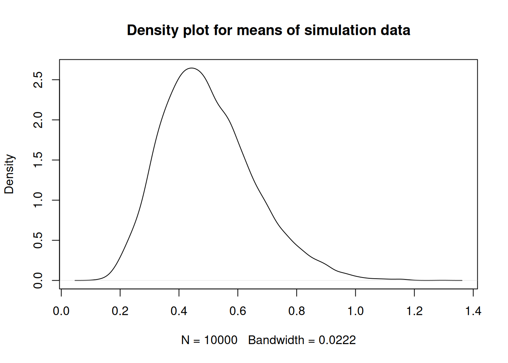
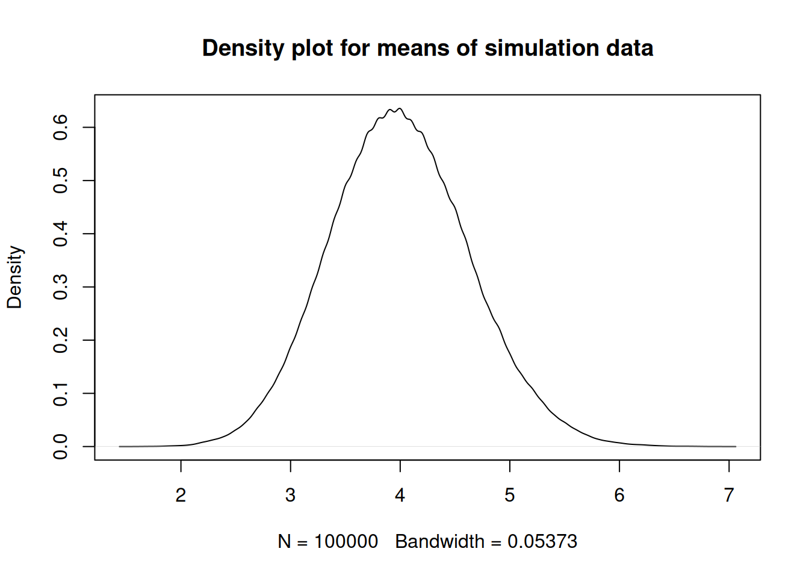

# Simulation of Unbiased Estimator

#### Bhuvan Kapoor 

``` r
# Simulation to show sample mean is an unbiased estimator for population mean

# Ques: When X1, X2,..., X10 is a random sample from an exponential random variable with rate 2.

exp_sample <- rexp(10,2)
exp_sample_mean <- mean(sample)
```

    ## Warning in mean.default(sample): argument is not numeric or logical: returning
    ## NA

``` r
exp_sample_mean
```

    ## [1] NA

``` r
simu_data_exp <- replicate(10000,{
  sample1 = rexp(10,2)
  mean(sample1)
})
mean(simu_data_exp)
```

    ## [1] 0.4989411

``` r
plot(density(simu_data_exp), main = "Density plot for means of simulation data")
```



``` r
# Ques: When X1, X2,..., X10 is a random sample from an poisson random variable with lambda 4.

poisson_sample <- rpois(10,4)
poisson_mean <- mean(poisson_sample)

simu_data_poisson <- replicate(100000,{
  rpois(10,4)
  mean(rpois(10,4))
})
mean(simu_data_poisson)
```

    ## [1] 3.998441

``` r
plot(density(simu_data_poisson), main = "Density plot for means of simulation data")
```

